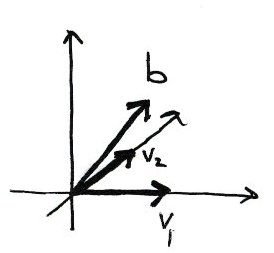
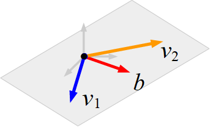

# Matrix Equation $Ax = b$

## Product of a Vector with a Matrix

In this section we introduce the idea of multiplying a vector by a matrix.

```{card} Definition

Let $A$ be an $m \times n$ matrix with columns $v_1, v_2, \ldots, v_n$:

$$A = \begin{pmatrix}|&|&&|\\v_1&v_2&\cdots&v_n\\|&|&&|\end{pmatrix}.$$

Then the **product**     of $A$ with a vector $x \in \mathbb{R}^n$ is the linear combination

$$Ax = \begin{pmatrix}|&|&&|\\v_1&v_2&\cdots&v_n\\|&|&&|\end{pmatrix}\begin{pmatrix}x_1\\x_2\\\vdots\\x_n\end{pmatrix} = x_1v_1 + x_2v_2 + \cdots + x_nv_n.$$

$Ax$ is a vector in $\mathbb{R}^m$.

```

In order for $Ax$ to make sense, the number of entries of $x$ has to be the same as the number of columns of $A$. We are using the entries of $x$ as the coefficients of the columns of $A$ in a linear combination. The resulting vector has the same number of entries as the number of rows of $A$, since each column of $A$ has that number of entries.

Note that this definition of muliplication of a vector by a matrix accords exactly with the definition you already studied for multiplying a matrix by a matrix.

:::{admonition} Example
:class: tip
Let 

$$A = \begin{pmatrix}4 & 5 & 6\\ 7 & 8 & 9\end{pmatrix}$$

and

$$x = \begin{pmatrix}1\\2\\3\end{pmatrix}$$

then 

$$Ax = \begin{pmatrix}4 & 5 & 6\\ 7 & 8 & 9\end{pmatrix}\begin{pmatrix}1\\2\\3\end{pmatrix} = 1\begin{pmatrix}4\\7\end{pmatrix} + 2\begin{pmatrix}5\\8\end{pmatrix} + 3\begin{pmatrix}6\\09\end{pmatrix} = \begin{pmatrix}32\\50\end{pmatrix}.$$

:::

Given a vectors $v_1, v_2, \ldots, v_n$ and $b$ in $\mathbb{R}^m$ then we can form the vector equation

$$x_1v_1 + x_2v_2 + \cdots + x_nv_n = b.$$

This is equivalent to the matrix equation $Ax = b$ where

$$A = \begin{pmatrix}|&|&&|\\v_1&v_2&\cdots&v_n\\|&|&&|\end{pmatrix} \quad\mathrm{and}\quad x = \begin{pmatrix}x_1\\x_2\\\vdots\\x_n\end{pmatrix}.$$

:::{admonition} Four Ways to Write a Linear System 

We now have four equivalent ways to express a linear system:

1\. As a system of equations:

$$
\begin{alignat*}{4}
 2x_1 & {}+{} &  3x_2 & {}-{} & 2x_3 & {}={} &  7  \\
x_1 & {}-{} & x_2 & {}-{} & 3x_3 & {}={} &  5.
\end{alignat*}
$$

2\. As an augmented matrix:

$$
\left(
\begin{array}{ccc|c}
2 & 3 & -2 & 7 \\
1 & -1 & -3 & 5 
\end{array}
\right).
$$

3\. As a vector equation:

$$x_1\begin{pmatrix}2\\1\end{pmatrix}+x_2\begin{pmatrix}3\\-1\end{pmatrix}+x_3\begin{pmatrix}-2\\-3\end{pmatrix}=\begin{pmatrix}7\\5\end{pmatrix}.$$

4\. As a matrix equation:

$$\begin{pmatrix}2&3&-2\\1&-1&-4\end{pmatrix}\begin{pmatrix}x_1\\x_2\\x_3\end{pmatrix} = \begin{pmatrix}7\\5\end{pmatrix}.$$
:::

:::{admonition} Example
:class: tip
Let $A = \begin{pmatrix}1&0\\0&1\\0&0\end{pmatrix}$. Does the equation $Ax = \begin{pmatrix}1\\1\\1\end{pmatrix}$ have a solution?

**Solution**

First we answer the question geometrically. The columns of $A$ are

$$v_1 = \begin{pmatrix}1\\0\\0\end{pmatrix}\quad\mathrm{and}\quad v_2 = \begin{pmatrix}0\\1\\0\end{pmatrix},$$

and the target vector (the right-hand side of the equation) is $b = \begin{pmatrix}1\\1\\1\end{pmatrix}$. The equation $Ax = b$ is consistent if and only if $b$ is contained in the span of the columns of $A$. So we draw a picture:



$\mathrm{Span}\{v_1, v_2\}$ is a horizontal plane through the origin. $b$ does not lie in this plane therefore the equation is inconsistent.

We can check our geometric answer by solving the matrix equation. The augmented matrix of the system

$$
\left(
\begin{array}{cc|c}
1 & 0 & 1 \\
0 & 1 & 1 \\
0 & 0 & 1
\end{array}
\right)
$$

is already in echelon form. The last equation is $0 = 1$, so the system is indeed inconsistent and the matrix equation $\begin{pmatrix}1\\1\\1\end{pmatrix}$ has no solution.

:::

:::{admonition} Example
:class: tip

Let 

$$v_1 = \begin{pmatrix}2\\-1\\1\end{pmatrix},\quad v_2 =\begin{pmatrix}1\\0\\-1\end{pmatrix}\quad\mathrm{and}\quad b=\begin{pmatrix}1\\-1\\2\end{pmatrix}.$$

Does $b$ lie in the subset spanned by $v_1$ and $v_2$?

**Solution**

$b$ is in $\mathrm{Span}\{v_1,v_2\}$ if an only if there exist $x_1, x_2$ such that

$$x_1\begin{pmatrix}2\\-1\\1\end{pmatrix}+x_2\begin{pmatrix}1\\0\\-1\end{pmatrix}=\begin{pmatrix}1\\-1\\2\end{pmatrix}.$$

We can write this as a matrix system and solve by row reduction of the augmented matrix:

$$
\left(
\begin{array}{cc|c}
2 & 1 & 1 \\
-1 & 0 & -1 \\
1 & -1 & 2
\end{array}
\right)
\xrightarrow{\mathrm{RREF}}
\left(
\begin{array}{cc|c}
1 & 0 & 1 \\
0 & 1 & -1 \\
0 & 0 & 0
\end{array}
\right) .
$$

The system is consistent with solution $x_1=1$ and $x_2 = -1$ and we conclude that $b$ lies in the subset spanned by $v_1$ and $v_2$.

Geometrically, $\mathrm{Span}\{v_1, v_2\}$ is a 2-dimensional plane and $b$ is a vector lying in the same plane. The figure below demonstrates what that might look like schematically. 



:::


```{card} Theorem

Let $A$ be an $m \times n$ matrix. The following are equivalent:

1. $Ax = b$ has a solution for all $b\in\mathbb{R}^m$.
2. The span of the columns of $A$ is all of $\mathbb{R}^m$.
3. $A$ has $m$ pivots.

```

## Solving $Ax = 0$

The equation $Ax=0$ has special significance and is easier to solve than the general equation $Ax = b$.

```{attention}
The $0$ on the right hand side of the equation $Ax=0$ is shorthand for a vector containing $m$ zeros.
```

```{card} Definition
An equation of the form $Ax = 0$ is **homogeneous**.

An equation of the form $Ax = b$ with $b \neq 0$ is **inhomogeneous**.
```

For example, given the homogeneous equation $Ax=0$, where

$$A=
\begin{pmatrix}
1 & 3 & 4\\
2 & -1 & 2\\
1 & 0 & 1\\
\end{pmatrix}
$$

we can use row operations to reduce the augmented matrix

$$
\left(
\begin{array}{ccc|c}
1 & 3 & 4 & 0\\
2 & -1 & 2 & 0\\
1 & 0 & 1 & 0
\end{array}
\right)
$$

to reduced row echelon form:

$$
\left(
\begin{array}{ccc|c}
1 & 0 & 0 & 0\\
0 & 1 & 0 & 0\\
0 & 0 & 1 & 0
\end{array}
\right)
$$

which has only the trivial solution $x=0$.

Note that the augmented part of the matrix is redundant since the zeros are not affected by the row operations. **It is not necessary to write an augmented matrix when solving homogeneous systems**.

```{admonition} Example
:class: tip

Solve the homogeneous equation $Ax=0$ where

$$A = \begin{pmatrix}1 & 0 & -8 & -7\\
0 & 1 & 4 & 3\\
 0 & 0 & 0 & 0\end{pmatrix}.$$

 **Solution**

 The matrix $A$ is already in echelon form. The equivalent system of equations is

 \begin{alignat*}{4}
 x_1 & \quad & & {}-{} & 8x_3 & {}-{} 7x_4 & {}={} & 0\\
& \quad & x_2 & {}+{} & 4x_3 & {}+{} 3x_4 & {}={} & 0
 \end{alignat*}

 which can be written in parametric form:

 \begin{alignat*}{3}
 x_1 & {}={} & 8x_3 & {}+{} & 7x_4\\
x_2 & {}={} & -4x_3 & {}-{} & 3x_4\\
  x_3 & {}={} & x_3 & &\\
 x_4 & {}={} & & & x_4.
 \end{alignat*}

 Or as a *vector equation*:

 $$x = \begin{pmatrix}x_1\\x_2\\x_3\\x_4\end{pmatrix}
 = x_3\begin{pmatrix}8\\-4\\1\\0\end{pmatrix}
 + x_4\begin{pmatrix}7\\-3\\0\\1\end{pmatrix}$$

 for any $x_3, x_4 \in \mathbb{R}$.

 The two vectors $\begin{pmatrix}8 \\-4\\ 1 \\ 0\end{pmatrix}$ and $\begin{pmatrix}7 \\ -3 \\ 0\\1\end{pmatrix}$ are the special solutions corresponding to the free variables $x_3$ and $x_4$ respectively. The solution is the set of all linear combinations of the special solutions.

 **The solution set is a plane passing through the origin**.

```

## Solving $Ax = b$

We now have everything we need to find the general solution to the inhomogeneous equation

$$Ax=b$$

```{admonition} The general solution to $Ax = b$

Let $A$ be an $(m \times n)$ matrix and $b$ a length-$m$ vector. Then the general solution to

$$Ax=b$$

is

$$x = t_1v_1 + \cdots + t_kv_k + v_0$$

where $t_1, \ldots\ t_k \in \mathbb{R}$ are real numbers and $v_1, \ldots, v_k$ are the $k$ special solutions corresponding to the $k$ free variables.

1. Form the augmented matrix $A|b$.
2. Use Gaussian elimination to find the reduced row echelon form and determine the $k$ free variables.
3. Write the parametric form of the solution set (write the corresponding system of linear equations, moving all free variables to the right hand side.)
4. Write the solution as a vector equation $v = t_1v_1 + \ldots + t_kv_k + v_0$.

```

```{admonition} Example
:class: tip

Determine the general solution to the following system of equations, expressing the answer in vector form:

$$
\begin{alignat*}{5}
-2x_1 & {}-{} & 4x_2 & {}-{} & 2x_3 & {}-{} & 10x_4 {}={} & 0\\
2x_1 & {}+{} & 4x_2 & {}+{} & x_3 & {}+{} & 9x_4 {}={} & -2\\
3x_1 & {}+{} & 6x_2 & {}+{} & x_3 & {}+{} & 13x_4 {}={} & -4.
\end{alignat*}$$

**Solution**

The augmented matrix is:

$$
\left(
\begin{array}{cccc|c}
-2 & -4 & -2 & -10 & 0\\
2 & 4 & 1 & 9 & -2\\
3 & 6 & 1 & 13 & -4
\end{array}\right).
$$

We have already determined the reduced row echelon form in  {ref}`this example<ex_gaussian_elimination>`:

$$
\left(
\begin{array}{cccc|c}
\boxed{1} & 2 & 0 & 4 & -2\\
0 & 0 & \boxed{1} & 1 & 2\\
0 & 0 & 0 & 0 & 0
\end{array}\right).
$$

Write as a system of equations with the free variables $x_2$ and $x_4$ on the right hand side:

$$
\begin{alignat*}{4}
x_1 & {}={} & -2x_2 & {}-{} & 4x_4 & {}-{} & 2\\
x_2 & {}={} & x_2\\
x_3 & {}={} &       &       & -x_4 & {}+{} & 2\\
x_4 & {}={} & x_4
\end{alignat*}.$$

Write this in vector form:

$$
\begin{pmatrix}x_1\\x_2\\x_3\\x_4\end{pmatrix} = \begin{pmatrix}-2x_2&-4x_4&-2\\x_2&&\\&-x_4&+2\\&x_4&\end{pmatrix} = x_2\begin{pmatrix}-2\\1\\0\\0\end{pmatrix} + x_4\begin{pmatrix}-4\\0\\-1\\1\end{pmatrix} + \begin{pmatrix}-2\\0\\2\\0\end{pmatrix}
$$

for any $x_2, x_4 \in \mathbb{R}$.
```

```{exercise}
:label: q_solve_system

For the matrix

$$A = \begin{pmatrix}1 & 1 \\ 0 & 0\end{pmatrix},$$

1. What are the special solution(s) to the homogeneous equation $Ax=0$?
2. What is the null space of $A$?
3. Find the general solution to $Ax = b$  where $b = \begin{pmatrix}5 \\ 0\end{pmatrix}$. Describe the solution geometrically.
```


```{exercise}
:label: q_solve_system

For the matrix

$$A = \begin{pmatrix}1 & 1 \\ 0 & 0\end{pmatrix},$$

1. What are the special solution(s) to the homogeneous equation $Ax=0$?
2. What is the null space of $A$?
3. Find the general solution to $Ax = b$  where $b = \begin{pmatrix}5 \\ 0\end{pmatrix}$. Describe the solution geometrically.
```

## Solutions

```{solution} q_solve_system

The matrix $A$ is already in reduced row echelon form, and $x_1$ is a pivot variable and $x_2$ a free variable.

1. There is one special solution corresponding to $x_2=1$ and it is $\begin{pmatrix}x_1\\x_2\end{pmatrix}=\begin{pmatrix}-1\\1\end{pmatrix}$
2. The null space is the space of all vectors $t\begin{pmatrix}-1\\1\end{pmatrix}, t \in \mathbb{R}$.
3. The general solution to $Ax = b$ is $x = t\begin{pmatrix}-1\\1\end{pmatrix} + \begin{pmatrix}5\\0\end{pmatrix}$ for $t \in \mathbb{R}$ which is a straight line parallel to $\begin{pmatrix}-1\\1\end{pmatrix}$ through the point $\begin{pmatrix}5\\0\end{pmatrix}$.

```
