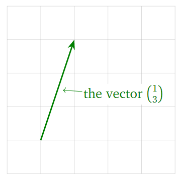
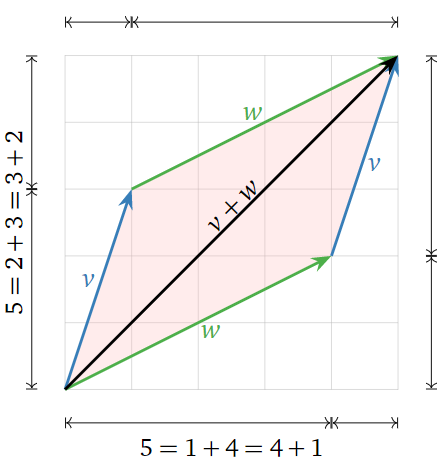
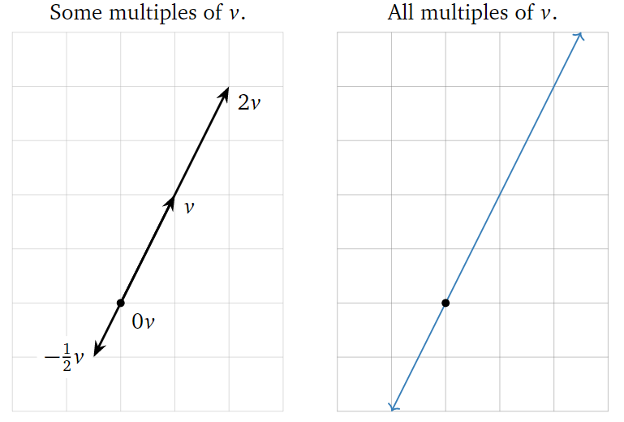
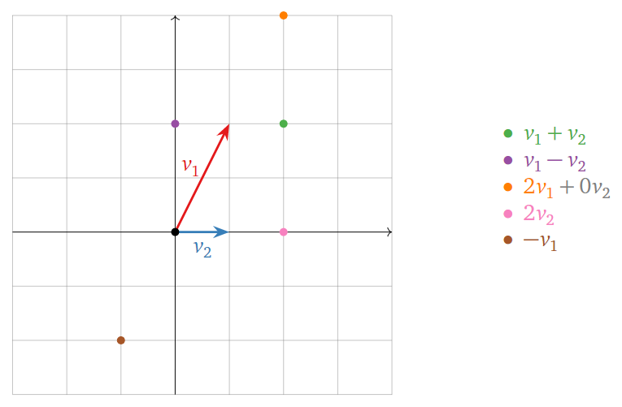
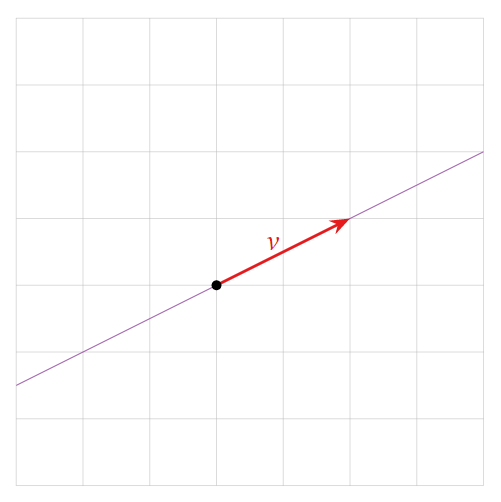
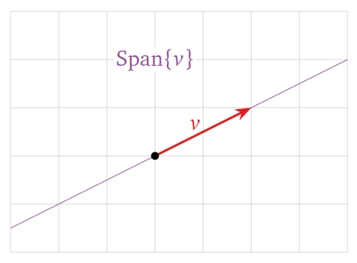
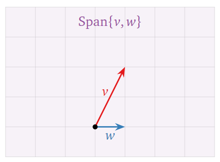
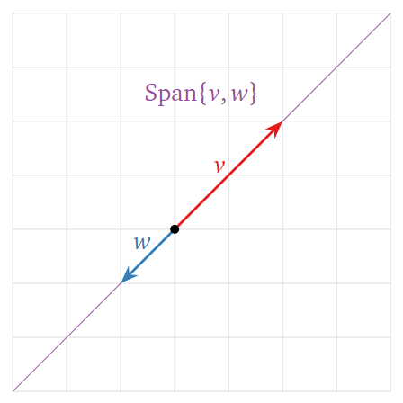

# Vectors

In this section we review the definition of a vector, how vectors can be interpreted geometrically, and how we can manipulate them algebraically.

## Vectors in $\mathbb{R}^n$

A **vector** is simply point in $\mathbb{R}^n$, usually written as a vertical list of $n$ elements representing the $n$ coordinates. For example a vector $v$ in $\mathbb{R}^2$ has two elements:

$$v = \begin{pmatrix}1\\3\end{pmatrix}.$$

A vector can be represented visually as an arrow. 



The visual representation of vectors as an arrow will be crucial when understanding the linear algebra concepts we study in this course. Even though we are limited to two or three dimensions when visualising vectors, the geometrical intuition extends naturally to higher dimensional vectors.

## Vector Addition and Scalar Multiplication

Two vectors can be added together by adding together individual coordinates:

$$\begin{pmatrix}x_1\\x_2\\x_3\end{pmatrix}+\begin{pmatrix}y_1\\y_2\\y_3\end{pmatrix} = \begin{pmatrix}x_1+y_1\\x_2+y_2\\x_3+y_3\end{pmatrix}.$$

A vector can be multiplied by a real number $c$:

$$c\begin{pmatrix}x_1\\x_2\\x_3\end{pmatrix} = \begin{pmatrix}cx_1\\cx_2\\cx_3\end{pmatrix}.$$

You have also studied how to multiply two vectors (for example using the dot or cross products) but multiplication of two vectors won't feature in the linear algebra studied in this course.

Addition of vectors can be interpreted geometrically using the **parallelogram law**. Given two vectors $v$ and $w$, the sum $v+w$ is the vector formed by placing the tail of $w$ at the head of $v$. For example,

$$\begin{pmatrix}1\\3\end{pmatrix}+\begin{pmatrix}4\\2\end{pmatrix} = \begin{pmatrix}5\\5\end{pmatrix}.$$

Doing this is the reverse order (placing the tail of $v$ at the head of $w$) creates a parallelogram.



A scalar multiple of a vector $v$ has the same (or opposite) direction, but a different length. For instance, $2v$ is the vector in the direction of $v$ but twice as long, and $−\frac{1}{2}v$ is the vector in the opposite direction of $v$, but half as long. Note that the set of all scalar multiples of a (nonzero) vector $v$ is a line.



## Linear Combinations of Vectors

We can add and scale multiple vectors in a single expression.

```{card} Definition

Let $c_1, c_2, \ldots, c_k$ be scalars and let $v_1, v_2, \ldots, v_k$ be vectors in $\mathbb{R}^n$. Then the vector in $\mathbb{R}^n$

$$c_1v_1 + c_2v_2 + \cdots + c_kv_k$$

is a **linear combination** of the vectors $v_1, v_2, \ldots, v_k$.

```

Geometrically, a linear combination is obtained by stretching / shrinking the vectors $v_1, v_2, \ldots, v_k$, then adding them together using the parallelogram law.

:::{admonition} Example
:class: tip

Let $v_1 = \begin{pmatrix}1\\2\end{pmatrix}$ and $v_2 = \begin{pmatrix}1\\0\end{pmatrix}$. Below are some linear combinations of $v_1$ and $v_2$.



The locations of these points are found using the parallelogram law for vector addition. Any vector on the plane is a linear combination of $v_1$ and $v_2$.
:::

:::{admonition} Example
:class: tip

A linear combination of a single vector $v = \begin{pmatrix}1\\2\end{pmatrix}$ is just a scalar multiple of $v$. Some examples include

$$v = \begin{pmatrix}1\\2\end{pmatrix}, \quad\frac{3}{2}v = \begin{pmatrix}3/2\\3\end{pmatrix}, \quad-\frac{1}{2}v = \begin{pmatrix}-1/2\\-1\end{pmatrix}, \quad\cdots.$$



The set of all linear combinations is the *line through v*.
:::

## Vector Equations

Given $k$ vectors $v_1, \ldots, v_k$ and another vector $b$ we can ask if $b$ is a linear combination of $v_1, \ldots, v_k$. If so then we can find coefficients $c_1, \ldots, c_k$ such that

$$c_1v_1 + \cdots + c_kv_k = b.$$

For example, suppose we have the vectors $v_1 = \begin{pmatrix}1\\2\\6\end{pmatrix}, v_2 = \begin{pmatrix}-1\\-2\\-1\end{pmatrix}$ and $b = \begin{pmatrix}8\\16\\3\end{pmatrix}$. Is $b$ a linear combination of $v_1$ and $v_2$? If so then there exist scalars $c_1$ and $c_2$ which solve the equation

$$c_1\begin{pmatrix}1\\2\\6\end{pmatrix} + c_2\begin{pmatrix}-1\\-2\\-1\end{pmatrix} = \begin{pmatrix}8\\16\\3\end{pmatrix}.$$

This simplifies to

$$\begin{pmatrix}c_1\\2c_1\\6c_1\end{pmatrix} + \begin{pmatrix}-c_2\\-2c_2\\-c_2\end{pmatrix}=\begin{pmatrix}8\\16\\3\end{pmatrix}\quad\mathrm{or}\quad\begin{pmatrix}c_1-c_2\\2c_1-2c_2\\6c_1-c_2\end{pmatrix} = \begin{pmatrix}8\\16\\3\end{pmatrix}.$$

For two vectors to be equal, all of their coordinates must be equal, so this is just the system of linear equations

$$
\begin{align*}c_1 - c_2 &=8\\2c_1-2c_2&=16\\6c_1-c_2&=3.\end{align*}
$$

Solving the vector equation is exactly the same as solving a system of linear equations.

:::{admonition} Example
:class: tip

Is $\begin{pmatrix}8\\16\\3\end{pmatrix}$ a linear combination of $\begin{pmatrix}1\\2\\6\end{pmatrix}$ and $\begin{pmatrix}-1\\-2\\-1\end{pmatrix}$ ?

**Solution**

As shown above, this is exactly the same as asking whether the following system of equations has a solution:

$$
\begin{align*}c_1 - c_2 &=8\\2c_1-2c_2&=16\\6c_1-c_2&=3.\end{align*}
$$

This can be determined using row reduction:

$$\left(
\begin{array}{cc|c}
1 & -1 & 8 \\
2 & -2 & 16 \\
6 & -1 & 3
\end{array}
\right)
\xrightarrow{\mathrm{RREF}}
\left(
\begin{array}{cc|c}
1 & 0 & -1 \\
0 & 1 & -9 \\
0 & 0 & 0
\end{array}
\right)
$$

From this we see that the equation is consistent with solution $c_1=-1$ and $c_2=-9$. Therefore $\begin{pmatrix}8\\16\\3\end{pmatrix}$ is indeed a linear combination of $\begin{pmatrix}1\\2\\6\end{pmatrix}$ and $\begin{pmatrix}-1\\-2\\-1\end{pmatrix}$ with coefficients $-1$ and $-9$:

$$-\begin{pmatrix}1\\2\\6\end{pmatrix} -9\begin{pmatrix}-1\\-2\\-1\end{pmatrix} = \begin{pmatrix}8\\16\\3\end{pmatrix}.$$
:::

## Spans

Given a set of vectors $v_1, v_2, \ldots, v_k$ in $\mathbb{R}^n$ in $\mathbb{R}^n$, we can consider the set of *all* of their linear combinations.

```{card} Definition

Let $v_1, v_2, \ldots, v_k$ be vectors in $\mathbb{R}^n$. The **span** of $v_1, v_2, \ldots, v_k$ is the set of all linear combinations of $v_1, v_2, \ldots, v_k$:

$$\mathrm{Span}\left\{v_1, v_2, \ldots, v_k\right\} = \left\{c_1v_1 + c_2v_2 + \cdots + c_kv_k | c_1, c_2, \ldots, c_k \in \mathbb{R}\right\}.$$

We also say that $\mathrm{Span}\left\{v_1, v_2, \ldots, v_k\right\}$ is the subset **spanned by** or **generated by** the vectors $v_1, v_2, \ldots, v_k$.

```

:::{admonition} Consistency

Suppose we have vectors $v_1, v_2, \ldots, v_k$ in $\mathbb{R}^n$ and another vector $b$ in $\mathbb{R}^n$. Then we have three equivalent ways of making the same statement:

1\. The vector $b$ is in $\mathrm{Span}\{v_1, v_2, \ldots, v_k\}$.

2\. The vector equation

$$c_1v_1 + \cdots + c_kv_k = b$$

has a solution.

3\. The linear system with augmented matrix

$$\left(
\begin{array}{cccc|c}
| & | & & | & |\\
v_1 & v_2 & \cdots & v_k &b \\
| & | & & | & | \\
\end{array}
\right)$$

is consistent.

:::

A picture of $\mathrm{Span}\left\{v_1, v_2, \ldots, v_k\right\}$ consists of a picture of all linear combinations of $v_1, v_2, \ldots, v_k$. For example the following three pictures show three different possibilities for spans in $\mathbb{R}^2$.

1\. A single vector whose span is a straight line through the origin.



2\. Two vectors whose span is the whole of $\mathbb{R}^2$.



3\. Two vectors whose span is a straight line through the origin.



