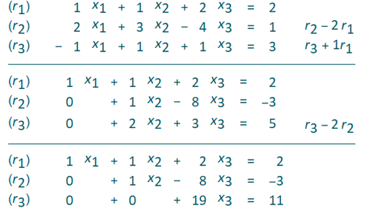
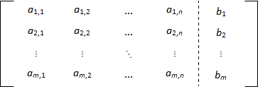
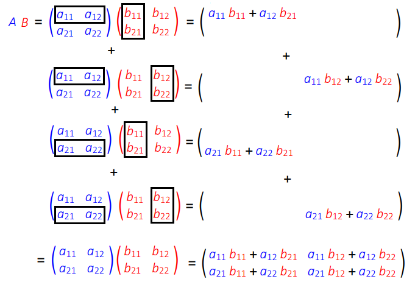
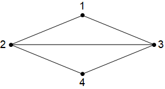

# Linear Systems and Matrices

## Gaussian Elimination

The technique studied here makes solving large systems of equations (e.g. 200 equations in 200 unknowns) practical, and it can be implemented on a computer in a basic programming language. You might be surprised to learn that it is necessary to solve vast systems of linear equations as a matter of routine in many practical scientific applications.

### Motivation

Gaussian elimination is a systematic technique for solving systems of linear equations, which are of the form

\begin{align}
a_{1,1} x_1 + a_{1,2} x_2 + a_{1,3} x_3 + \dots + a_{1,n} x_n &= b_1 \\

   a_{2,1} x_1 + a_{2,2} x_2 + a_{2,3} x_3 + \dots + a_{2,n} x_n &= b_2\\
                                                                     \vdots \\
 a_{m,1} x_1 + a_{m,2} x_2 + a_{m,3} x_3 + \dots + a_{m,n} x_n &= b_m
\end{align}


where $a_{i,j}$ are constants. Usually there are the same number of equations as unknowns, so $m = n$.  If $m < n$ then the system is undetermined, if $m > n$, the system is over constrained.

```{admonition} Example
:class: tip
\begin{align}4 x_1 - x_2 &= 1\\ -2 x_1 + 3 x_2 &= 12 \end{align}
Each equation here defines a line, and we are looking for a point which satisfies both equations, which means that the lines intersect.

From the first line we obtain $x_2 = 4 x_1 - 1$, and by substituting this into the second line, we obtain $x = \frac{3}{2}$, $y = 5$. Two equations with two unknowns will always give a unique solution, unless the lines are parallel (and so the equations are just a scaling of each other).

-	If they are parallel and distinct, there are no solutions because there are no points that lie on both lines.
-	If they are parallel and coincident (same line), there are an infinite number of solutions.
```
(gaussian-elimination)=
### A systematic technique for solving systems of equations

We will begin by finding a solution to the following system:


The equations have been labelled $r_1,r_2,r_3$
First, we will use $r_1$ to eliminate $x_1$ from $r_2$ and $r_3$. This gives two equations in two unknowns. Then, we will use $r_2$ to eliminate $x_2$ from $r_3$.
The steps are written out below:    

The solution for $x_3$ can now be read off from $r_3$, $x_2$ can be obtained from $r_2$ using the result for $x_3$ and $x_1$ can be obtained from $r_1$ using the results for $x_1$ and $x_2$ - This is known as **back-substitution**.  

These manipulations can be conveniently done by looking only at the coefficients, which we collect together in a form called the augmented matrix:



We can see that the algorithm (described in the box below) works by eliminating the coefficients below the leading diagonal, which is highlighted in pink in the image.

```{admonition} Naive Gaussian elimination algorithm (obtaining upper triangular form)
**Step 1** Choose initial pivot

We choose the first element from the leading diagonal as the pivot element.

**Step 2** Row reduction step

Add multiples of the pivot row to the rows below, to obtain zeros in the pivot column below the leading diagonal.

**Step 3** Choose new pivot

The pivot moves to the next element on the leading diagonal.  

**Repeat**
Repeat from Step 2 until the matrix is in upper triangular form (containing all zeros below the leading diagonal).

The solutions can then be obtained by back-substitution.
```

```{admonition} Examples for you to try
:class: tip
You can use the following app to generate a system of three equations in three unknowns and solve it using the Gaussian elimination algorithm given in Box 3.1. In the solutions, the pivot element in each step is highlighted in blue.
https://www.wolframcloud.com/obj/ucqssjm/Published/gaussian-elimination
```

### Generalisation
The naive algorithm introduced here can be generalised to include additional row operations. In general, the acceptable row operations that we can perform are:
-	multiplication of any row by a constant
-	addition of (a multiple of) any row to any other
-	swapping any two rows

It is often possible to apply these steps creatively to get a result with greater efficiency than using the naive algorithm described above. However, in this course the assessed questions will all require you to carry out the naive algorithm. There are two reasons for this:
1. To test your ability to follow an algorithm or set of rules. Once you can follow an algorithm precisely, accurately and definitively, this is the starting point at which you could programme a computer to automate the method.
2. For ease of process-checking - for example, when using automated quiz-marking, or when comparing solutions.

It is also not necessary to stop at upper triangular form. Once the last row has been fully simplified, it can be used to obtain zeros above the main diagonal in the last column. Then, the second-last row is used to obtain zeros in the second-last column above the main diagonal, and so-on until the only non-zero elements remaining are on the main diagonal. Then the solutions can be simply read off from each row.
For instance, continuing with the naive row reduction for the example shown in the previous section, we obtain


We have obtained row-reduced form and the solutions for $x_1,x_2,x_3$ can now be read off from the final column.

### Application: Kirchoff's Law
In general, Gaussian elimination can be used to solve the problems obtained by applying Kirchoff's laws. For example, see the problems given here:

https://www.intmath.com/matrices-determinants/6-matrices-linear-equations.php

In the example below, the technique is applied to a case where the system of equations is under-determined, so a unique solution cannot be obtained.

Kirchoff's law states that $\mathrm{current~in} = \mathrm{current~out}.

For the system of 4 nodes shown above, this gives us four equations:

\begin{align}y_3&=y_1+y_4\\y_1&=y_2+y_5\\y_2&=y_3+y_6\\y_4+y_5+y_6&=0\end{align}

The equations at each node are of the form $c_1 y_1 +c_2 y_2+\dots +c_6 y_6=d$. Written in augmented matrix form, the system is:

$$\left(\begin{array}{cccccc:c}1 & 0 & -1 & 1 & 0 & 0 &0\\-1 & 1 & 0 & 0 & 1 & 0&0 \\0 & -1 & 1 & 0 & 0 & 1&0 \\0 & 0 & 0 & -1 & -1 & -1 &0\\\end{array}\right)$$

The first 6 columns are for the coefficients of $y_1,\dots y_6$ and the last column is the constant term that appears on the right hand side of the equation.

Here, Gaussian elimination is applied as usual, but the complicating factor is that there are more unknowns than equations and so the system is under-determined. It has "free variables", that can be made to take any value!

After applying Gaussian elimination to the pivot elements in the first and second column, we can't do anything with the third column without spoiling the progress we've made in the first two columns, so we leave that one and move on to use the fourth column as a pivot. After that, we can't make any more progress so we stop. We obtain:

$$\left(\begin{array}{cccccc:c}1 & 0 & -1 & 0 & -1 & -1 & 0 \\0 & 1 & -1 & 0 & 0 & -1 & 0 \\0 & 0 & 0 & 1 & 1 & 1 & 0 \\0 & 0 & 0 & 0 & 0 & 0 & 0 \\\end{array}\right)$$

The first, second, and fourth columns are the pivot columns, and the other columns are all "free" since they can be obtained from a combination of the other columns.

Choosing $(y_3,y_5,y_6)=(1,0,0)$ gives the special solution $s_1:(1,1,1,0,0,0)$  
Choosing $(y_3,y_5,y_6)=(0,1,0)$ gives the special solution $s_2:(1,0,0,-1,1,0)$  
Choosing $(y_3,y_5,y_6)=(0,0,1)$ gives the special solution $s_3:(1,1,0,-1,0,1)$

The full solution space consists of all possible linear combinations $a s_1 + b s_2 +c s_3$.

## Matrix Definitions

A matrix (plural: matrices) is essentially just an array (or collection) of values, arranged in rows and columns. For example, when we were solving systems of linear equations by Gaussian elimination, we formed the **augmented matrix** of coefficients:



The dashed line was used to indicate that the matrix is partitioned into two sub-matrices, representing the coefficients and constant terms, respectively.

In general, the values contained in a matrix could represent anything, although manipulating systems of linear equations is one of the most valuable uses of matrices.

The Gaussian elimination technique that we have looked at is a brute force method for solving a given set of equations, whilst matrix methods are more concerned with finding general solutions and simplifications of certain types of problems.

### Notation

Two example matrices are given below

```{math}
:label: square_matrix
\left( \begin{matrix} 1 & -3 \\ 2 & -1 \end{matrix} \right) \qquad \left[ \begin{matrix} 1 & -3 \\ 2 & -1 \end{matrix} \right]
```

It is important that you do not use commas to separate the elements, which is incorrect notation.

Either square or round brackets can be used to denote a matrix - but you should avoid mixing notation. Other types of brackets cannot be used, so none of the expressions below are matrices. In fact, the third expression has a special meaning, as we will see later.

\begin{align}\begin{matrix} 1 & -3 \\ 2 & -1 \end{matrix} \qquad \left\{ \begin{matrix} 1 & -3 \\ 2 & -1 \end{matrix} \right\} \qquad \left| \begin{matrix} 1 & -3 \\ 2 & -1 \end{matrix} \right|	\end{align}

### Terminology

The matrix featured in {eq}`square_matrix` is referred to as a square matrix because it has the same number of rows and columns. We also can say that it is a (2x2) matrix, because it has two rows and two columns.

The number of rows must be given first:

$ \left( \begin{matrix} 1 & -3 & 5\\ 2 & -1 & 7\end{matrix} \right) $  is a (2 x 3) matrix, $ \left( \begin{matrix} 1 & -3 \\ 2 & -1 \\ 5 & 7\end{matrix} \right) $ is a (3 x 2) matrix.

This measurement is properly referred to as the **order** of a matrix, but is also often referred to as the **size** or **dimensions**.

The individual values in a matrix are called **elements**, so in the matrix $ M = \left( \begin{matrix} 1 &2 &3 \\ 4& 5& 6\end{matrix} \right) $ we can say that the element in the $2^{nd}$ row and $3^{rd}$ column is the number 6. Subscripts can be used to refer to the elements, by writing $ M_{2,3} = 6$ for example.

The **transpose** of a matrix, written with a superscript letter T, means that we swap the rows and columns, as in the example given below:

$ M = \left( \begin{matrix} 1 &2 &3 \\ 4& 5& 6\end{matrix} \right) \Rightarrow M^T = \left( \begin{matrix} 1 & 4 \\ 2 & 5  \\ 3 & 6\end{matrix} \right)$

In element notation, for any matrix $X$, we can write that $X^T_{i,j} = X_{j,i}$.

That is, the element in the $i^{th}$ row and $j^{th}$ column of $X$ becomes the element in the $j^{th}$ row and $i^{th}$ column of $X^T$.

The order of a matrix is reversed when it it transposed.

In a square matrix, two diagonals are called the **main diagonal** (top-left two bottom right), and the **anti-diagonal** (bottom-left to top-right). Square matrices for which $A_{i,j}=A_{j,i}$ are called **symmetric matrices**.

An **upper-triangular matrix** is a square matrix in which the elements below the main diagonal are all zero, and a **lower-triangular matrix** is one where the elements above the main diagonal are all zero.

A **diagonal matrix** is one in which all of the elements are zero apart from those on the main diagonal. These type of matrices are very special, since they have "nice" properties for the purpose of matrix algebra.    

(q_matrix_definitions)=
### Questions

1. What is the order of each of the matrices shown?
$A=\left(\begin{array}{cc}0 & -1 \\2 & 3 \\-1 & 0 \\\end{array}\right)$,   $\mathbf{b}=\left(\begin{array}{c}1 \\2 \\3 \\\end{array}\right)$,   $c=0$
2. Given the matrix $X=\left(\begin{array}{ccc}-3 & 4 & 0 \\1 & 1 & 2 \\7 & -4 & 3 \\\end{array}\right)$, what element is represented by $(X^T)_{2,3}$ ?
3. Which of the following matrices is an upper-triangular matrix?
$A=\left(\begin{array}{cccc}2&8&-1&0\\0&2&2&2\\0&0&1&-5\\0&0&0&3\end{array}\right)$, $B=\left(\begin{array}{cccc}1&-2&5&2\\3&6&-2&0\\8&2&0&0\\-2&0&0&0\end{array}\right)$, $C=\left(\begin{array}{ccc}6&0&0\\-3&-4&0\\2&7&7\end{array}\right)$

## Matrix algebra

We will look at how real number algebra, such as addition and multiplication, can be extended to work with matrices. These are entirely human constructs, and you may be easily forgiven for asking why do we do it this way?

However, the best way to appreciate the practicalities is by tackling some problems, and so the definitions will first be introduced without much explanation. From a mathematical perspective, we simply note that the definitions must be consistent and well-determined (unambiguous).

### Multiplication by a scalar

Let $\lambda$ be a scalar (a single number) and $M$ be a matrix. Then $\lambda M$ means that every element in matrix $M$ is multiplied by $\lambda$. This can be written in element notation as follows:

$$ (\lambda M)_{i,j} = \lambda M_{i,j}$$

For example, $ -3\left( \begin{matrix} 0 & -2 \\ 1 & 5 \\ -1 & 3 \end{matrix} \right) = \left( \begin{matrix} 0 & 6 \\ -3 & -15 \\ 3 & -9 \end{matrix} \right) $.

### Addition

Let $A$ and $B$ be two matrices of the same order. Then,

$$(A + B)_{i,j} = A_{i,j} + B_{i,j}$$

The expression states that to add two matrices, we add together the corresponding elements. This type of operation on two matrices can be referred to as an element-wise operation.

For example, $ \left( \begin{matrix} 1 & -3 \\ 3 & 0 \\ 5 & -7 \end{matrix} \right) + \left( \begin{matrix} 0 & 6 \\ -3 & -15 \\ 3 & -9 \end{matrix} \right) = \left( \begin{matrix} 1 & 3 \\ 0 & -15 \\ 8 & -16 \end{matrix} \right) $.


The element-wise property means that only matrices of the same order can be added, and the expressions below are both meaningless:

$$ \left( \begin{matrix} 1 & 2 \end{matrix} \right) + \left( \begin{matrix} 1 & 2 \\ 3 & 4 \end{matrix} \right) $$

$$\left( \begin{matrix} 1 & 2 \\ 3 & 4 \end{matrix} \right) + 1 $$

Matrix addition can be combined with multiplication by a scalar to add multiples of one matrix to another.

For example, $ \left( \begin{matrix} 1 & -3 \\ 3 & 0 \\ 5 & -7 \end{matrix} \right) - 3\left( \begin{matrix} 0 & -2 \\ 1 & 5 \\ -1 & 3 \end{matrix} \right) = \left( \begin{matrix} 1 & 3 \\ 0 & -15 \\ 8 & -16 \end{matrix} \right) $.
(q_matrix_arithmetic)=
### Questions

Given the matrices $A=\left(\begin{array}{cc}1 & 2 \\-1 & 0 \\3 & 1 \\\end{array}\right)$, $B=\left(\begin{array}{cc}-4 & 1 \\1 & 2 \\-2 & 3 \\\end{array}\right)$, $C=\left(\begin{array}{cc}0 & 3 \\4 & 2 \\1 & 1 \\\end{array}\right)$, $D=\left(\begin{array}{cc}5 & 1 \\3 & 2 \\\end{array}\right)$, what will be the result of the following expressions?

1. $(A+B)+C$
2. $(C+B)+A$
3. $A-2B+\frac{1}{2}C$
4. $A+D$

### Matrix multiplication

To multiply two matrices together, their inner dimensions must be the same. That is, to calculate $ \boldsymbol{A}\boldsymbol{B} $, the number of columns in $\boldsymbol{A}$ must be the same as the number of rows in $\boldsymbol{B}$. The order of the product matrix is given by the outer dimensions of the two matrices. We can represent this result visually:


```{admonition} Matrix Multiplication

Given a $(p × r)$ matrix $\boldsymbol{A}$ and a $(r × q)$ matrix $\boldsymbol{B}$, the matrix product $\boldsymbol{A\,B}$ defines a $(p × q)$ matrix, whose elements are given by

$$ (A B)_{i,j} = \sum_k  A_{i,k} B_{k,j} $$
```

To perform matrix multiplication, we must take elements in a row on the left hand side matrix and multiply with elements in a column on the right hand side matrix. The process is illustrate graphically here for a (2 x 2 ) example:



(q_matrix_multiplication)=
### Questions

Given that $A=\left(\begin{array}{ccc}3 & 1 & -2 \\0 & 2 & 4 \\\end{array}\right)$,   $B=\left(\begin{array}{cc}2 & 3 \\-3 & 0 \\1 & 1 \\\end{array}\right)$,   $C=\left(\begin{array}{cccc}1 & -8 & 2 & 11 \\0 & 4 & -3 & -7 \\6 & 1 & 8 & 1 \\\end{array}\right)$,    $D=\left(\begin{array}{ccc}1 & 2 & 3 \\1 & 1 & 1 \\2 & 0 & 1 \end{array}\right)$,

1. Calculate $AB$ and $BA$. Are these results the same?
2. Explain why the result $A\left(\begin{array}{c}1\\2\end{array}\right)$ cannot be calculated.
3. What will be the order of the matrix $A C$?
4. Calculate the element in the second row and third column of $AC$
5. Calculate the result $D^2$ (this question is a bit boring, but good practice!)


### Application: Walk lengths

Consider the connected graph below, in which the vertices have been numbered 1-4:



The graph can be represented by an adjacency matrix $A$ in which element $A_{i,j}$ is either 1 or 0 identifying if  vertex $i$ is or is not connected to vertex $j$. For this graph we have:

$$A=\left(\begin{array}{cccc}0 & 1 & 1 & 0 \\1 & 0 & 1 & 1 \\1 & 1 & 0 & 1 \\0 & 1 & 1 & 0 \\\end{array}\right)$$

It can be proved by induction that the result $S^N$ tells us how many $N$-step paths there are between each pair of vertices (see inductive step outline below). Therefore, if we want the number of 3-step paths between each pair of vertices, we can compute

$$M^3=\left(\begin{array}{cccc}2 & 5 & 5 & 2 \\5 & 4 & 5 & 5 \\5 & 5 & 4 & 5 \\2 & 5 & 5 & 2 \\\end{array}\right)$$

For instance, there are 5 walks of length 3 between vertices 1 and 2. Can you find them all?

**Inductive step outline:**

If $S^{N-1}$ gives all walks of length $N-1$ between pairs of vertices, then the following result gives the number of paths starting at node $i$ and ending at vertex $j$, obtained by taking one extra step from each connected vertex:

$$S^N_{i,j}=S^{N-1}_{i,1}S_{1,j}+S^{N-1}_{i,2}S_{2,j}+S^{N-1}_{i,3}S_{3,j}+S^{N-1}_{i,4}S_{4,j}$$

### Properties of marix multiplication

Matrix multiplication is **associative**, that is

$$A (B C)\equiv (A B)C$$

This can be proved by showing that the left and right hand sides are the same order, and that $(A(B C))_{i,j}=((A B)C)_{i,j}$.

Matrix multiplication is **NOT commutative**, that is

$$\begin{array}{c}A B\neq B A \end{array}$$

(although the  $AB$ and $BA$ may be equal in some special cases).

```{warning}
For two matrices $A$ and $B$, in general $AB \neq BA$.

Forgetting the matrix multiplication is non-commutative leads to disaster!
```

```{admonition} Example
:class: tip
**Worked example illustrating non-commutative property**

$$\left(\begin{array}{cc}1 & 2 \\-3 & 0 \end{array}\right) \left(\begin{array}{cc}2 & 1 \\1 & 2 \\\end{array}\right)=\left(\begin{array}{cc}1\ 2+2\ 1 & 1\ 1+2\ 2 \\0\ 1-3\ 2 & 0\ 2-3\ 1\end{array}\right)=\left(\begin{array}{cc}4 & 5 \\-6 & -3 \\\end{array}\right)$$

$$\left(\begin{array}{cc}2 & 1 \\1 & 2 \\\end{array}\right) \left(\begin{array}{cc}1 & 2 \\-3 & 0 \end{array}\right)=\left(\begin{array}{cc}2\ 1+1 (-3) & 2\ 2+1\ 0 \\1\ 1+2 (-3) & 1\ 2+2\ 0 \end{array}\right)=\left(\begin{array}{cc}-1 & 4 \\-5 & 2 \\\end{array}\right)$$
```

### Transpose Property

The following result is true in general (provided that $A$ and $B$ can be multiplied). Have a go at proving it for the case where $A$ and $B$ are both (2x2) matrices.
a general proof using element notation, is given below.

$$(A B)^T=B^T A^T $$

**Proof**

$$(A B)^T{}_{i,j}=A B_{j,i}=\sum _k A_{j,k} B_{k,i}=\sum _k A_{j,k} B_{k,i}=\sum _k A^T{}_{k,j} B^T{}_{i,k}=A^T B^T{}_{i,j}$$

### The identity matrix

The identity matrix In is the unique $(n \times n)$ matrix which has the property

$$\boldsymbol{I}_n \boldsymbol{A} = \boldsymbol{A} \boldsymbol{I}_n = \boldsymbol{A } $$

where $\boldsymbol{A}$ is also a $(n \times n)$ matrix. Thus, the identity matrix plays the same role in matrix multiplication as the number 1 does for multiplication of real numbers. It is possible to extend the definition to include the concept of a ‘left-identity’ and a ‘right-identity’ for matrices that are non-square, but it will not be necessary for our purposes.

It should be clear that the identity matrix needs to be the same dimensions as $\boldsymbol{A}$:

$$ \begin{matrix} \boldsymbol{I} & \boldsymbol{A} &=& \boldsymbol{A} & \boldsymbol{I}\\ (? ×?) & (n × n) && (n × n) & (? ×?) \end{matrix} $$

We usually drop the subscript $n$ when working with the identity matrix, because the order can be inferred.
(q_matrix_identity)=
### Questions

1. What matrix satisfies the definition for $\boldsymbol{I}_2$?
2. What matrix satisfies the definition for $\boldsymbol{I}_3$?
3. Can you factorise $AB+\lambda B$ where $\lambda$ is a scalar and $A,B$ are square matrices?


### Linking matrix multiplication and Gaussian elimination

The row-reduction operations that were introduced in the section on Gaussian elimination can be implemented by matrix multiplication. The illustration here matches the example that was given in {ref}`gaussian-elimination` for the augmented coefficient matrix:

\begin{equation}A = \left(\begin{array}{ccc:c}1&1&2&2\\2&3&-4&1\\-1&1&1&3\end{array}\right).\end{equation}

In the first step we used the row operations $\hat{r}_2=r_2-2r_1$,   $\hat{r}_3=r_3+r_1$, and in the second step we used the row operation $\hat{r}_3=r_3-2r_2$. These are equivalent to the following row operation matrices:

$$L_1 = \left(\begin{array}{ccc}1&0&0\\-2&1&0\\1&0&1\end{array}\right), \quad  L_2=\left(\begin{array}{ccc}1 & 0 & 0 \\0 & 1 & 0 \\0 & -2 & 1 \\\end{array}\right) $$

The composition of these two matrices puts the coefficient matrix into the upper triangular form previously obtained:

\begin{equation}L_2 L_1 A = \left(\begin{array}{ccc}1 & 0 & 0 \\0 & 1 & 0 \\0 & -2 & 1 \\\end{array}\right)\left(\begin{array}{ccc:c}1 & 1 & 2 & 2 \\0 & 1 & -8 & -3 \\0 & 2 & 3 & 5 \\\end{array}\right)=\left(\begin{array}{ccc:c}1 & 1 & 2 & 2 \\0 & 1 & -8 & -3 \\0 & 0 & 19 & 11 \\\end{array}\right).\end{equation}

The additional operations that were carried out to fully row-reduce the matrix can be captured in the following row-reduction matrices:

\begin{equation}P=\left(\begin{array}{ccc}1 & 0 & 0 \\0 & 1 & 0 \\0 & 0 & \frac{1}{19} \\\end{array}\right), \quad U_1=\left(\begin{array}{ccc}1 & 0 & -2 \\0 & 1 & 8 \\0 & 0 & 1 \\\end{array}\right), \quad U_2 = \left(\begin{array}{ccc}1 & 0 & -2 \\0 & 1 & 8 \\0 & 0 & 1 \\\end{array}\right)\end{equation}

You may verify the result:

$$U_2 U_1 P L_2 L_1 A =\left(\begin{array}{ccc:c}1 & 0 & 0 & -\frac{15}{19} \\0 & 1 & 0 & \frac{31}{19} \\0 & 0 & 1 & \frac{11}{19} \\\end{array}\right)$$

It is also possible to combine the row reduction operations into a single multiplication matrix:

\begin{equation}U_2 U_1 P L_2 L_1 = \frac{1}{19}\left(\begin{array}{ccc}7 & 1 & -10 \\2 & 3 & 8 \\5 & -2 & 1 \\\end{array}\right)\end{equation}.

Later, we will come to think of this as the inverse of the coefficient matrix.

## The (2x2) inverse

### Concept and definition

Suppose that we are given the definitions below and asked to compute the result for $B$ :

$$A=\left(\begin{array}{cc}1 & 2 \\2 & 1 \end{array}\right), \quad A B=\left(\begin{array}{cc}5 & 3 \\4 & 3 \end{array}\right)$$ (a_ab)

If this was ordinary scalar algebra, then $B$ would be given by $\frac{AB}{A}$, but we have not defined the concept of division for matrices. Indeed, we should recognise a difficulty in doing so, since matrix multiplication is not commutative. The problems $Q X = P$ and $X Q=P$ do not generally have the same solution, and so the expression $X=\frac{P}{Q}$ would be ambiguous.

The difficulty could be addressed by introducing separate concepts of "left-division" and "right-division", and some authors have done exactly this. However, a more fundamental approach is to abandon the idea of division for matrices altogether, and consider what it means for matrix multiplication to be invertible.

The inverse of an operation should somehow take us back to where we started. Specifically, we require that the inverse matrix $A^{-1}$ satisfies the definition given below. We restrict the definition to the inverse of a square matrix, because the inverse of a non-square matrix is generally not well defined.

```{admonition} The Inverse Matrix

For a given $(n\times n)$ matrix $A$, the inverse matrix $A^{-1}$ is the $(n\times n)$ matrix which satisfies the result

$$A A^{-1} = A^{-1}A=I$$

where $I$ is the identity matrix.

Thus, if we multiply a result by matrix $A$ then to get back to where we started we can multiply by $A^{-1}$
```

To illustrate the use of the inverse matrix, we multiply each side of the equation for $A B$ in {eq}`a_ab` by $A^{-1}$ as follows:

$$A^{-1}(AB)=A^{-1}\left(\begin{array}{cc}5&3\\4&3\end{array}\right)$$ (a_inverse_ab)

It is very important to recognise that we must do exactly the same thing to both sides of the equation. Since we pre-multiply (left multiply) the left-hand side by $A^{-1}$, we must also pre-multiply the right-hand side by $A^{-1}$.

Due to the non-commutative nature of matrix multiplication, the result $A^{-1}(A B)$ is not the same as the result $(A B)A^{-1}$.

Now, since matrix multiplication is associative, the left hand side of {eq}`a_inverse_ab` can be rewritten as $(A^{-1} A)B$, and by the definitions of the inverse and identity matrix, we can write $(A^{-1} A)B=I B=B$ in order to obtain

$$B=A^{-1}\left(\begin{array}{cc}5&3\\4&3\end{array}\right)$$

Thus, the result for $B$ can be determined by performing a matrix multiplication, provided that we can find $A^{-1}$.

```{admonition} Solving $AX=B$ and $XA=B$

In general, we can show that:

$A X = B$ has solution $X=A^{-1}B $

$X A = B$ has solution $X=B A^{-1}$

(provided that the inverse exists and can be determined).

These two results are broadly equivalent to the definitions of left and right division that are used by some authors.
```
(q_matrix_inverse)=
### Questions

Given that $C X D = E$, write down the solution for $X$ explicitly in terms of inverse matrices $C^{-1}$ and $D^{-1}$.

### Calculating the (2x2) inverse

The (2x2) matrix that satisfies the definition $A A^{-1} = A^{-1}A=I$ is outlined in the box below. In section 3.6 we will examine how the result may be derived from first principles, but for now you may simply verify the claim by checking the result of the products $A A^{-1}$ and $A^{-1}A$.

```{admonition} The inverse of a (2x2) matrix

The inverse of a (2x2) matrix $A=\left(\begin{array}{cc}a_{11} & a_{12} \\a_{21} & a_{22} \end{array}\right)$ is given by

$$A^{-1}=\frac{1}{\mathrm{det}(A)}\mathrm{adj}(A)$$

where

$$\mathrm{det}(A)=\left|\begin{array}{cc}a_{11} & a_{12} \\a_{21} & a_{22} \end{array}\right|=a_{11} a_{22}-a_{12} a_{21}$$

and

$$\mathrm{adj}A=\left(\begin{array}{cc}a_{22} & -a_{12} \\-a_{21} & a_{11} \end{array}\right)$$

(note that $\text{det}(A)$ is a scalar quantity).

$\text{det}(A)$ s referred to as the determinant of $A$. For a (2x2) matrix, the determinant is given by subtracting the product of the anti-diagonal elements from the product of the leading diagonal elements.  

$\text{adj}(A)$ is known as the adjugate matrix. For a (2x2) matrix, the adjugate is given by swapping the diagonal elements and multiplying the anti-diagonal elements by -1.

Notice the special notation $|A|$ that is used to denote the determinant of $A$.
```
(q_twobytwo_inverse)=
### Questions

1\. 	Calculate the determinant of the matrix $M=\left(\begin{array}{cc}2 & -1 \\3 & 4 \end{array}\right)$.

2\. 	Write the equations below in the form $A\mathbf{x}=\mathbf{b}$:
\begin{align*}
2x-3y&=1\\
3x-2y&=2
\end{align*}

Calculate the coefficient matrix $A$ and hence obtain the solution for $\mathbf{x}$

3\.	Solve the problem given in {eq}`a_ab` to find B.

### What it means if $det(A)=0$

The value of the determinant can be used to infer whether a given linear system has a unique solution. If the determinant is zero then the matrix $A$ is not **invertible** and the problem will not have a unique solution.


To illustrate, we will consider two examples of a system of two equations in two unknowns:

$$\begin{array}{c}2 x-3 y&=1 \\9 y-6 x&=3 \end{array}$$ (inconsistent_1)
$$\begin{array}{c}2 x-3 y&=1 \\9 y-6 x&=-3 \end{array}$$ (inconsistent_2)

Both sets of equations can be written in the form $A \mathbf{x} =\mathbf{b}$, where $A=\left(\begin{array}{cc}2 & -3 \\-6 & 9 \end{array}\right)$. In that case, $\det(A)=18-18=0$, which means that the inverse matrix cannot be calculated and the problems do not have a unique solution for $\underline{x}$.

The two equations in {eq}`inconsistent_1` are inconsistent, and so there is no solution, whilst the two equations in {eq}`inconsistent_2` have an infinite number of solutions satisfying $y=\frac{2}{3}x-\frac{1}{3}$.

You can also think about this problem graphically. In general, the determinant of a (2x2) matrix $A$ is zero if and only if the second row is a constant multiple of the first row. For a problem of the form $A\underline{x}=\underline{b}$, this means that the two lines have the same gradient. Either the equations represent distinct parallel lines, with no common points, or they represent the same line, with all points in common. In this example, both lines have gradient 2/3.

(q_dodgy_proof)=
### Questions

What is wrong with the following "proof" ?

Assume $A,B$ are two matrices of the same order, with $AB=\underline{\underline{0}}$ and $A\neq\underline{\underline{0}}$. Then, $A^{−1}AB=A^{−1}\underline{\underline{0}} \Rightarrow B=\underline{\underline{0}}$

### Derivation of the (2x2) inverse from first principles

Consider the problem $A X = I$, which has solution $X=A^{-1}$. We can solve this problem applying row reduction operations (Gaussian elimination) to the augmented matrix $\biggr[\begin{array}{c:c}A&I\end{array}\biggr]$.

The algorithm proceeds as follows:

\begin{equation}\biggr[\begin{array}{c:c}A&I\end{array}\biggr]\quad \rightarrow \quad \biggr[\begin{array}{c:c}U&L\end{array}\biggr] \quad \rightarrow \quad \biggr[\begin{array}{c:c}I&A^{-1}\end{array}\biggr]\end{equation}
in which $U$ is an upper-diagonal matrix and $L$ is a lower-diagonal matrix.

For the (2x2) problem we start with the augmented matrix:

$$A=\left(\begin{array}{cc:cc}a_{11} & a_{12} & 1 & 0 \\a_{21} & a_{22} & 0 & 1 \\\end{array}\right)$$

the following row operations can be used:

1. $\hat{r}_2=r_2-r_1 a_{21}/a_{11}$
1. $\hat{r}_1=r_1/a_{11}$,    $\hat{r}_2=r_2 a_{11}/(a_{11}a_{22}-a_{12}a_{21})$
1. $\hat{r}_1=r_1-r_2 a_{12}/a_{11}$

We obtain

\begin{equation}\left[\begin{array}{cc:cc}a_{11}&a_{12}&1&0\\a_{21}&a_{22}&0&1\end{array}\right] \quad \Rightarrow \quad \left[\begin{array}{cc:cc}1&0&\frac{a_{22}}{a_{11}a_{22}-a_{12}a_{21}}&\frac{-a_{12}}{a_{11}a_{22}-a_{12}a_{21}}\\0&1&\frac{-a_{21}}{a_{11}a_{22}-a_{12}a_{21}}&\frac{a_{11}}{a_{11}a_{22}-a_{12}a_{21}}\end{array}\right]\end{equation}

from which the following result for the inverse matrix $A^{-1}$ is inferred:

$$A^{-1}=\frac{1}{a_{11} a_{22}-a_{12} a_{21}}\left(\begin{array}{cc}a_{22} & -a_{12} \\ -a_{22} & a_{11} \end{array}\right)$$

The steps that were carried out here were purely algebraic manipulations, and so we can see that the result for $A^{-1}$ can always be computed, providing that $a_{11} a_{22}-a_{12} a_{21}\neq 0$.

## The (3x3) inverse

### The (3x3) determinant

We can extend the method used in the previous section to calculate the inverse of higher order matrices. For example, you could have a go at calculating the inverse of a general (3x3) matrix by Gaussian elimination. The algebra would get very tedious.

However, given the systematic nature of Gaussian elimination, you may not be surprised that there is a pattern that can be spotted, which allows the inverse to be calculated by a recursive method. The result is given in the box below.

```{admonition} The (3x3) inverse formula

The inverse of a (3x3) matrix $A$ is given by

$$A^{-1}=\frac{\mathrm{adj}(A)}{\mathrm{det}(A)}=\frac{C_A^T}{\mathrm{det}A}$$

where $\mathrm{adj}(A)$ is called the **adjugate** matrix and $C_A$ is the (3x3) matrix of cofactors given by

$$(C_A)_{i,j}=(-1)^{i+j}M_{i,j}.$$

The **minors** $M_{i,j}$ are the determinants of the (2x2) matrices formed by deleting the $i$th row and $j$th column of $A$.

The determinant satisfies both of the following results, so you can choose either:

$\displaystyle\mathrm{det}(A)=\sum_{j=1}^3{a_{i,j}C_{i,j}}$ for any choice of row $i$     (expansion by the ith row)

$\displaystyle\mathrm{det}(A)=\sum_{i=1}^3{a_{i,j}C_{i,j}}$ for any choice of row $j$     (expansion by the jth column)
```

Let's unpack this complicated definition by considering an example for

$$A=\left(\begin{array}{ccc}3 & -2 & 4 \\2 & -2 & 3 \\5 & -1 & 7 \end{array}\right)$$

Then, we have the following cofactors:

$$C_{1,1}=(-1)^{1+1}\left|\begin{array}{cc}-2&3\\-1&7\end{array}\right|=-11, \quad C_{1,2}=(-1)^{1+2}\left|\begin{array}{cc}2&3\\5&7\end{array}\right|=1, \quad C_{1,3}=(-1)^{1+3}\left|\begin{array}{cc}2&-2\\5&-1\end{array}\right|=8,$$

$$C_{2,1}=(-1)^{2+1}\left|\begin{array}{cc}-2&4\\-1&7\end{array}\right|=10, \quad C_{2,2}=(-1)^{2+2}\left|\begin{array}{cc}3&4\\5&7\end{array}\right|=1, \quad C_{2,3}=(-1)^{2+3}\left|\begin{array}{cc}3&-2\\5&-1\end{array}\right|=-7,$$

$$C_{3,1}=(-1)^{3+1}\left|\begin{array}{cc}-2&4\\-2&3\end{array}\right|=2, \quad C_{3,2}=(-1)^{3+2}\left|\begin{array}{cc}3&4\\2&3\end{array}\right|=-1, \quad C_{3,3}=(-1)^{3+3}\left|\begin{array}{cc}3&-2\\2&-2\end{array}\right|=-2,$$

We can find the determinant by expansion of any row or column.

For instance, if we choose to expand by the first row (i=1), we obtain

$\mathrm{det}(A)=a_{1,1}C_{1,1}+a_{1,2}C_{1,2}+a_{1,3}C_{1,3} = 3(-11) -2(1) +4(8)=-3$

You may pick any other row or column to expand and you will obtain the same result. For instance, expanding by the third column gives

$\mathrm{det}(A)=a_{1,3}C_{1,3}+a_{2,3}C_{2,3}+a_{3,3}C_{3,3} = 4(8) +3(-7) +7(-2)=-3$

The inverse matrix is given by

$A^{-1}=\frac{-1}{3}\left(\begin{array}{ccc}-11&10&2\\1&1&-1\\8&-7&-2\end{array}\right)$

```{admonition} Examples
:class: tip
You can use the following app to generate random (3x3) matrices to practice finding the inverse, and check your answers using the solutions given.

https://www.wolframcloud.com/obj/ucqssjm/Published/33inverse
```


### The inverse of the matrix product

By associativity of matrix multiplication,

$$(A^{-1}B^{-1})(BA) = A^{-1}(B^{-1}B)A = A^{-1}IA=A^{-1}A=I$$

Therefore,

$$(BA)^{-1} = A^{-1}B^{-1}$$

This result satisfies the "common sense" idea (seen in function composition) that inversion comes in reverse order. If transform B follows transform A then we have to reverse transform B before reversing A. We remove the outer operation first.

We can liken the result to the operation of getting dressed/undressed: If you put your socks on before your shoes, you have to take your shoes off before you can remove your socks!

## Solutions to Exercises

{numref}`Question %s <q_matrix_definitions>`

$A$ is a (3 x 2) matrix, since it has 3 rows and 2 columns.
Matrices are nearly always given upper case letters as variable names.

$\mathbf{b}$ is a (3 x 1) matrix.
Matrices with a single column are a special case, called a column vector, and they are usually given bold lower case letters as variable names.
To represent a bold letter by hand, we underline it like this: $\underline{b}$

$c$ is a (1 x 1) matrix.
In that case, we could dispense with the brackets, since it is equivalent to a scalar (basically just a single value).

The element in the second row and third column of the transpose matrix is the element in the third row and second column of the original matrix, so the result is -4.

The only upper-triangular matrix here is $A$. Matrix $B$ is an upper anti-triangular matrix and matrix $C$ is a lower triangular matrix

{numref}`Question %s <q_matrix_arithmetic>`

Matrix addition is both commutative and associative, because it is an elementwise operation and therefore has the same properties as addition of real numbers. Thus, the first two expressions give the same result:

$(A+B)+C=A+(B+C)=\left(\begin{array}{cc}1-4+0 & 2+1+3 \\-1+1+4 & 0+2+2 \\3-2+1 & 1+3+1 \\\end{array}\right)=\left(\begin{array}{cc}-3 & 6 \\4 & 4 \\2 & 5 \\\end{array}\right)$

The third expression gives:

$A-2 B+\frac{C}{2}=\left(\begin{array}{cc}1+8+0 & 2-2+\frac{3}{2} \\-1-2+2 & 0-4+1 \\3+4+\frac{1}{2} & 1-6+\frac{1}{2} \\\end{array}\right)=\left(\begin{array}{cc}9 & \frac{3}{2} \\-1 & -3 \\\frac{15}{2} & -\frac{9}{2} \\\end{array}\right)$

Since $A$ and $D$ are not the same order, these two matrices cannot be added

{numref}`Question %s <q_matrix_multiplication>`

$A B=\left(\begin{array}{cc}(3\times 2)+(1 \times-3)+(-2\times 1) & (3\times 3)+(1\times 0)+(-2\times 1) \$0\times 2)+(2\times -3)+(4\times 1) & (0\times 3)+(2\times 0)+(4\times 1) \end{array}\right)=\left(\begin{array}{cc}1 & 7 \\-2 & 4 \end{array}\right)$

We multiplied a (2x3) matrix with a (3x2) matrix. The result is a (2x2) matrix. The two results are not the same, and do not even have the same dimensions.

In general, $A B\neq B A$, even when $A$ and $B$ are square matrices. That is, matrix multiplication is NOT COMMUTATIVE.

According to the definition $A B_{i,j}= \sum _k A_{i,k} B_{k,j}$, whilst $B A_{i,j}= \sum _k A_{k,j} B_{i,k}$. In the first case, the multiplied elements come from the $i^{th}$ row of $A$ and the $j^{th}$ column of B. In the second case, the multiplied elements come from the $i^{th}$ row of $B$ and the $j^{th}$ column of $A$

The given result cannot be calculated because the inner dimensions do not match. That is, the number of columns in the left hand matrix does not match the number of rows in the right hand matrix.

Since A is (2x3) and C is (3x4), the result A C is (2x4). Notice that the result C A is impossible.
The element in the second row and third column is given by multiplying the second row of A and the third column of C to give (0*2)+(2*-3)+(4*8)=26.

$\left(\begin{array}{ccc}9 & 4 & 8 \\4 & 3 & 5 \\4 & 4 & 7 \\\end{array}\right)$


{numref}`Question %s <q_matrix_identity>`

Your first guess might be just a lot of number 1's:

$ \left( \begin{matrix} 1 & 1 \\ 1 & 1 \end{matrix} \right) $

but this instead produces:

$ \left( \begin{matrix} 1 & 1 \\ 1 & 1 \end{matrix} \right) \left(\begin{matrix} a_{11} & a_{12} \\ a_{21} & a_{22} \end{matrix} \right) = \left(\begin{matrix} a_{11} + a_{21} & a_{12} + a_{22} \\ a_{11} + a_{21} & a_{12} + a_{22} \end{matrix} \right) \neq \left(\begin{matrix} a_{11} & a_{12} \\ a_{21} & a_{22} \end{matrix} \right) $

The (2x2) matrix which satisfies the Identity matrices definition is given by

$ \left( \begin{matrix} 1 & 0 \\ 0 & 1 \end{matrix} \right) $

Check by yourself that this the results in

$ \left(\begin{matrix} 1 & 0 \\ 0 & 1 \end{matrix} \right) \left(\begin{matrix} a_{11} & a_{12} \\ a_{21} & a_{22} \end{matrix} \right) = \left(\begin{matrix} a_{11} & a_{12} \\ a_{21} & a_{22} \end{matrix} \right) \left(\begin{matrix} 1 & 0 \\ 0 & 1 \end{matrix} \right) = \left(\begin{matrix} a_{11} & a_{12} \\ a_{21} & a_{22} \end{matrix} \right) $

To arrive at the general result for any dimension, we will use the definition of matrix multiplication. We require that

$ (A I)_{i,j} = (I A)_{i,j} = A_{i,j} $

and in summation notation this means that

$ \sum_k A_{i,k} I_{k,j} = \sum_k I_{i,k} A_{k,j} = A_{i,j}$

The definition is satisfied if (and only if)

$ I_{k,j} = \left\{ \begin{array}{ll} 1 & \text{if} &k = j \\ 0& \text{if} &k \neq j \\ \end{array} \right. $

So, all entries of the identity matrix are 0, except where the row and column numbers are the same - we call this the leading diagonal.

The $(3 × 3)$ identity matrix $\boldsymbol{I}_3$ therefore is:

$ \left( \begin{matrix} 1 & 0 & 0\\ 0 & 1 &0 \\ 0 & 0 & 1\end{matrix} \right) $


The key here is to recognise that $(A+\lambda)B$ is not valid, since a scalar can't be meaningfully added to a matrix. But by recognising that $B=IB$ where I is the identity matrix, we can write

$AB+\lambda B=AB+\lambda IB=(A+\lambda I)B$

You can try it for an example. For instance, if
\begin{equation}A=\left(\begin{array}{cc}2&3\\-1&4\end{array}\right), \quad B=\left(\begin{array}{cc}2&-1\\1&1\end{array}\right), \quad \lambda=3\end{equation}
Then, $AB+\lambda B = \left(\begin{array}{cc}2&3\\-1&4\end{array}\right) \left(\begin{array}{cc}2&-1\\1&1\end{array}\right)+3\left(\begin{array}{cc}2&-1\\1&1\end{array}\right)= \left(\begin{array}{cc}7&1\\2&5\end{array}\right)+ \left(\begin{array}{cc}6&-3\\3&3\end{array}\right)= \left(\begin{array}{cc}13&-2\\5&8\end{array}\right)$
And $(A+\lambda I)B=\left(\begin{array}{cc}2+3&3\\-1&4+3\end{array}\right) \left(\begin{array}{cc}2&-1\\1&1\end{array}\right)= \left(\begin{array}{cc}13&-2\\5&8\end{array}\right)$


{numref}`Question %s <q_matrix_inverse>`

We left multiply by $C^{-1}$ and right multiply by $D^{-1}$ to obtain $X=C^{-1} E D^{-1}$.
If you wrote down any other answer then it is incorrect!


{numref}`Question %s <q_twobytwo_inverse>`

 $\det  M=(2*4)-(-1*3)=11$


We have $A=\left(\begin{array}{cc}2 & -3 \\3 & -2 \end{array}\right)$, $\mathbf{x}=\left(\begin{array}{c}x\\y\end{array}\right)$,   $b=\left(\begin{array}{c}1 \\2 \end{array}\right)$

$A^{-1}=\frac{1}{9-4}\left(\begin{array}{cc}-2 & 3 \\-3 & 2 \end{array}\right)$ so $\mathbf{x}=\frac{1}{5} \left(\begin{array}{cc}-2 & 3 \\-3 & 2 \end{array}\right) \left(\begin{array}{c}1 \\2 \end{array}\right)=\frac{1}{5} \left(\begin{array}{c}6-2 \\4-3 \end{array}\right)$

That is, $x=4/5$, $y=1/5$. (Check it!)


$B=A^{-1}\left(\begin{array}{cc}5 & 3 \\4 & 3 \end{array}\right)=-\frac{1}{3} \left(\begin{array}{cc}1 & -2 \\-2 & 1 \end{array}\right) \left(\begin{array}{cc}5 & 3 \\4 & 3 \end{array}\right)=-\frac{1}{3} \left(\begin{array}{cc}5-8 & 3-6 \\4-10 & 3-6 \end{array}\right)=\left(\begin{array}{cc} 1 & 1 \\2 & 1 \\\end{array}\right)$

{numref}`Question %s <q_dodgy_proof>`

The argument fails if $\det(A)=0$, because in that case matrix $A$ is not invertible. For instance, in the case where

$A=\left(\begin{array}{cc}1&2\\2&4\end{array}\right)$ and $B=\left(\begin{array}{cc}8 & 4 \\-4 & -2 \\\end{array}\right)$, we obtain $AB=\left(\begin{array}{cc}0&0\\0&0\end{array}\right)$.
